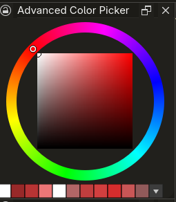

# Advanced Color Picker (V-HSV)

完美复刻 SAI 色彩特性的 V-HSV 拾色器

## 功能特性

*   提供清透鲜艳的暗部色彩
*   原生级圆锥渐变色相环
*   悬浮颜色对比预览
*   高自适应浮动历史颜色网格
*   右键面板可打开设置菜单
*   **持久化记忆：** 支持持久化保存配置参数及所有拾取的历史记录

## 兼容性说明

本插件兼容 **Krita 5.0 及以上版本**（支持 PyQt5 与 PyQt6 双引擎环境）。

## 安装与使用

1.  将插件放入 Krita 的 `pykrita` 目录
2.  在 Krita 的插件管理器中启用本插件
3.  在面板区域打开“Advanced Color Picker”
4.  使用右键点击拾色器区域即可打开专属设置界面
